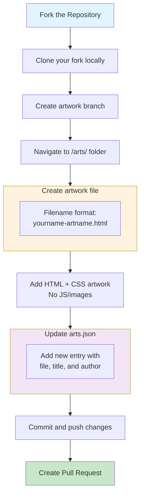

<!-- Centered banner for README -->
<p align="center">
  
</p>

<p align="center">
  
</p>

### How to Contribute

1. **Fork** this repo
2. **Clone** your fork locally
    ```bash
    git clone [https://github.com/](https://github.com/)<your-username>/css-art-museum.git
    cd css-art-museum
    ```
    Create a branch for your **artwork**
    ```bash
    git checkout -b my-artwork
    ```

3. **Add your artwork**

    Navigate to the `/arts/` folder
    Create a new file: `yourname-artname.html` 
    Add your HTML + CSS artwork (no JS/images)
    Update `arts.json` or the gallery page to include your art.
   ```bash
    {
    "file": "example.html",
    "title": "example",
    "author": "example"
   }
   ```

## 🤝 Contributors Recognition

We ❤️ every contribution! Whether it’s code, CSS art, or ideas, we want to give you **props** on our **Contributors Page**.  

---

###  How to Add Yourself

1. **Open** the file: [`Contributors/contributors.json`](Contributors/contributors.json)  
2. **Check if your GitHub username is listed**  
   - ✅ Already listed → No action needed!  
   - ❌ Not listed → Add yourself at the **end of the list**  

3. **Add your username** like this:
```json
{
  "username": "your-github-username"
}
```

4. **Commit & push your changes:**
```bash
git add .
git commit -m "Added CSS artwork: yourname-artname"
git push origin my-artwork
```

5. **Create a Pull Request (PR):**

Go to your fork → Click Compare & Pull Request
Add a screenshot of your artwork in the PR description
Once merged, your name will appear on the Contributors Page 🎉


---

## 📌 Rules
- Only **original CSS art** (no images)  
- Keep code clean and commented  
- Small contributions (like text/typo only) will be marked invalid  
- PRs will be accepted with `hacktoberfest-accepted` label

- ⚠️ Note: When raising a PR, please add a screenshot of both your code changes and the output/result. PRs without screenshots may take longer to review.

--- 
<div align="center">

## 💌 Happy Contributing! 💖

<!-- Typing-style SVGs -->
<svg height="40" width="300">
  <text x="0" y="25" fill="#FF69B4" font-size="20" font-family="monospace">✨ Keep Creating ✨</text>
</svg>

<svg height="40" width="350">
  <text x="0" y="25" fill="#00CED1" font-size="20" font-family="monospace">⌨️ Typing... Typing... ⌨️</text>
</svg>


---

Made with ❤️ by **Shamli** and fellow **Contributors of the Pixel Museum Community**.

</p>
</div>
